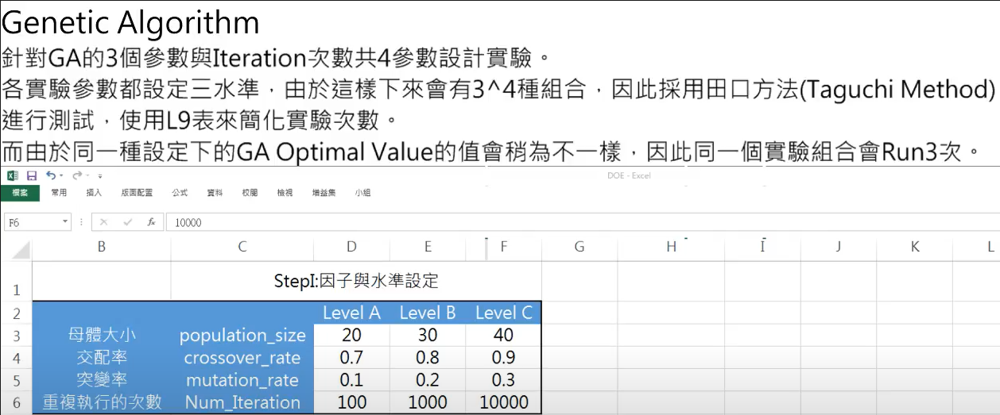

# Tabu
- 修改自 [Tabu Search Algorithm](https://github.com/PO-LAB/Intelligent-Manufacturing-Systems/blob/master/Tabu_Algorithm/Tabu_Algorithm.md)
# GA 
- 修改自 [GA flow shop](https://github.com/wurmen/Genetic-Algorithm-for-Job-Shop-Scheduling-and-NSGA-II/blob/master/implementation%20with%20python/GA-flowshop/GA%20for%20flow%20shop%20problem.md)

# Parameter settings
-  tabu size, crossover rate, mutation rate

# Result
- optimal function(job sequence) 
- optimal function(fitness value) >>finite number of steps
- runnung time
- average tardiness
- number of tardy jobs

# Experiment
1. tabu size 設計
從size=2~10

2. GA 參數設計
- 田口方法

# 參考資料

[IMS課程作業 Tabu Search的Tabu size影響](https://www.youtube.com/watch?v=_mWdjidNBvs)

[IMS課程作業 GA參數影響實驗過程](https://www.youtube.com/watch?v=s56X-qtxGNs)

# Question
1. tabu size 的決定(大小的差別)
2. GA的設計(參數設計、只能試嗎?)
3. 怎麼兩種做比較(時間? 空間複雜度?) 結果好壞
